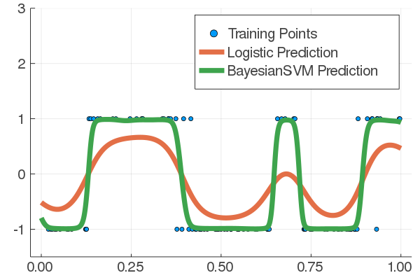
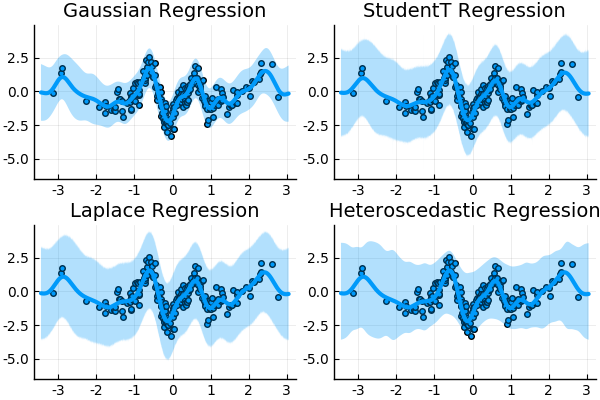
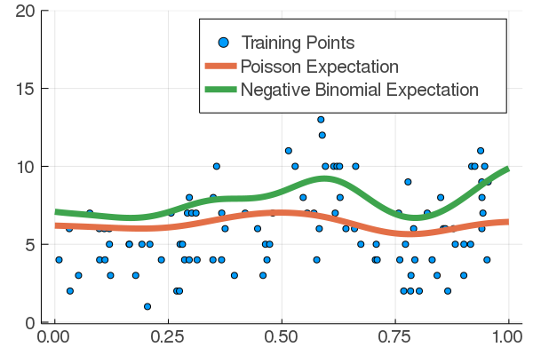

[](https://theogf.github.io/AugmentedGaussianProcesses.jl/dev)
[](https://theogf.github.io/AugmentedGaussianProcesses.jl/stable)
[](https://travis-ci.org/theogf/AugmentedGaussianProcesses.jl)
[](https://coveralls.io/github/theogf/AugmentedGaussianProcesses.jl?branch=master)
[](https://zenodo.org/badge/latestdoi/118922202)

AugmentedGaussianProcesses.jl is a Julia package in development for **Data Augmented Sparse Gaussian Processes**. It contains a collection of models for different **gaussian and non-gaussian likelihoods**, which are transformed via data augmentation into **conditionally conjugate likelihood** allowing for **extremely fast inference** via block coordinate updates. There are also more options to use more traditional **variational inference** via quadrature or Monte Carlo integration.

### You can also use the package in Python via [PyJulia](https://github.com/JuliaPy/pyjulia)!

# Packages models :

## Two GP classification likelihood
  - **BayesianSVM** : A Classifier with a likelihood equivalent to the classic SVM [IJulia example](https://nbviewer.jupyter.org/github/theogf/AugmentedGaussianProcesses.jl/blob/master/examples/Classification%20-%20BayesianSVM.ipynb)/[Reference][arxivbsvm]
  - **Logistic** : A Classifier with a Bernoulli likelihood with the logistic link [IJulia example](https://nbviewer.jupyter.org/github/theogf/AugmentedGaussianProcesses.jl/blob/master/examples/Classification%20-%20Logistic.ipynb)/[Reference][arxivxgpc]

<p align=center>
  
</p>

---
## Four GP Regression likelihood
  - **Gaussian** : The standard Gaussian Process regression model with a Gaussian Likelihood (no data augmentation was needed here) [IJulia example](https://nbviewer.jupyter.org/github/theogf/AugmentedGaussianProcesses.jl/blob/master/examples/Regression%20-%20Gaussian.ipynb)/[Reference][arxivgpbigdata]
  - **StudentT** : The standard Gaussian Process regression with a Student-t likelihood (the degree of freedom ν is not optimizable for the moment) [IJulia example](https://nbviewer.jupyter.org/github/theogf/AugmentedGaussianProcesses.jl/blob/master/examples/Regression%20-%20StudentT.ipynb)/[Reference][jmlrstudentt]
  - **Laplace** : Gaussian Process regression with a Laplace likelihood [IJulia example](https://nbviewer.jupyter.org/github/theogf/AugmentedGaussianProcesses.jl/blob/master/examples/Regression%20-%20Laplace.ipynb)/(No reference at the moment)
  - **Heteroscedastic** : Regression with non-stationary noise, given by an additional GP. (no reference at the moment)

<p align=center>
   
 </p>
---
## Two GP event counting likelihoods

 - **Discrete Poisson Process** : Estimating a the Poisson parameter λ at every point (as λ₀σ(f)). (no reference at the moment)
 - **Negative Binomial** : Estimating the success probability at every point for a negative binomial distribution (no reference at the miment)

 <p align=center>
    
  </p>

---
## One Multi-Class Classification Likelihood
  - **Logistic-SoftMax** : A modified version of the softmax where the exponential is replaced by the logistic function [IJulia example](https://nbviewer.jupyter.org/github/theogf/AugmentedGaussianProcesses.jl/blob/master/examples/MultiClass%20-%20LogisticSoftMax.ipynb)/[Reference][uaimulticlass]

 <p align=center>
   
 </p>

## More models in development
  - **Probit** : A Classifier with a Bernoulli likelihood with the probit link
  - **Online** : Allowing for all algorithms to work online as well

## Install the package

The package requires at least [Julia 1.1](https://julialang.org/)
Run `julia`, press `]` and type `add AugmentedGaussianProcesses`, it will install the package and all its dependencies.

## Use the package

A complete documentation is available [in the docs](https://theogf.github.io/AugmentedGaussianProcesses.jl/stable). For a short start now you can use this very basic example where `X_train` is a matrix ``N x D`` where `N` is the number of training points and `D` is the number of dimensions and `Y_train` is a vector of outputs (or matrix of independent outputs).

```julia
using AugmentedGaussianProcesses
model = SVGP(X_train,Y_train,RBFKernel(1.0),LogisticLikelihood(),AnalyticSVI(100),64)
train!(model,iterations=100)
Y_predic = predict_y(model,X_test) #For getting the label directly
Y_predic_prob, Y_predic_prob_var = proba_y(model,X_test) #For getting the likelihood (and likelihood uncertainty) of predicting class 1
```

Both [documentation](https://theogf.github.io/AugmentedGaussianProcesses.jl/stable/) and [examples/tutorials](https://nbviewer.jupyter.org/github/theogf/AugmentedGaussianProcesses.jl/tree/master/examples/) are available.

## References :

Check out [my website for more news](https://theogf.github.io)

["Gaussian Processes for Machine Learning"](http://www.gaussianprocess.org/gpml/) by Carl Edward Rasmussen and Christopher K.I. Williams

UAI 19' "Multi-Class Gaussian Process Classification Made Conjugate: Efficient Inference via Data Augmentation" by Théo Galy-Fajou, Florian Wenzel, Christian Donner and Manfred Opper [https://arxiv.org/abs/1905.09670][uaimulticlass]

ECML 17' "Bayesian Nonlinear Support Vector Machines for Big Data" by Florian Wenzel, Théo Galy-Fajou, Matthäus Deutsch and Marius Kloft. [https://arxiv.org/abs/1707.05532][arxivbsvm]

AAAI 19' "Efficient Gaussian Process Classification using Polya-Gamma Variables" by Florian Wenzel, Théo Galy-Fajou, Christian Donner, Marius Kloft and Manfred Opper. [https://arxiv.org/abs/1802.06383][arxivxgpc]

UAI 13' "Gaussian Process for Big Data" by James Hensman, Nicolo Fusi and Neil D. Lawrence [https://arxiv.org/abs/1309.6835][arxivgpbigdata]

JMLR 11' "Robust Gaussian process regression with a Student-t likelihood." by Jylänki Pasi, Jarno Vanhatalo, and Aki Vehtari.  [http://www.jmlr.org/papers/v12/jylanki11a.html][jmlrstudentt]

[uaimulticlass]:https://arxiv.org/abs/1905.09670
[arxivgpbigdata]:https://arxiv.org/abs/1309.6835
[31b06e91]:https://github.com/theogf/AugmentedGaussianProcesses.jl/blob/master/examples/Classification%20-%20SXGPC.ipynb "Classification with Sparse XGPC"
[arxivbsvm]:https://arxiv.org/abs/1707.05532
[arxivxgpc]:https://arxiv.org/abs/1802.06383
[jmlrstudentt]:http://www.jmlr.org/papers/volume12/jylanki11a/jylanki11a.pdf
